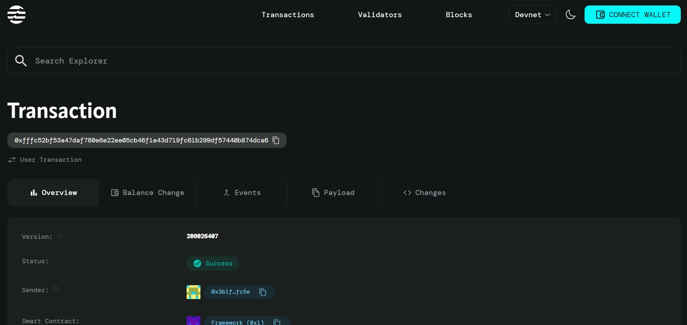

# Autonomous Vehicle Coordination System

## Project Description

The Autonomous Vehicle Coordination System is a revolutionary blockchain-based platform built on the Aptos network that transforms traditional vehicle management through smart contracts. This decentralized system automates vehicle registration, insurance tracking, pollution certificate monitoring, and compliance management while ensuring transparency, security, and fraud prevention.

The system leverages Move smart contracts to create an immutable record of vehicle ownership, documentation status, and renewal requirements. It provides real-time monitoring of document expiries and automatically triggers renewal notifications to vehicle owners, insurance companies, police, and RTO offices 2 weeks before expiration.

## Project Vision

Our vision is to create a fully autonomous, transparent, and efficient vehicle coordination ecosystem that:

- **Eliminates Document Fraud**: Using blockchain-backed verification and decentralized identity (DID) systems
- **Automates Compliance**: Smart contracts automatically track and manage document renewals
- **Enhances Security**: Biometric verification prevents identity fraud and unauthorized access
- **Reduces Bureaucracy**: Streamlined processes reduce paperwork and manual interventions
- **Improves Public Safety**: Real-time tracking helps in vehicle theft recovery and compliance monitoring

## Key Features

###  Decentralized Identity (DID) Management
- Store vehicle chassis numbers (VIN) and owner details on-chain
- Biometric verification with hash storage for enhanced security
- Prevention of fake renewals and identity fraud through blockchain verification

###  Smart Document Management
- Automated tracking of registration, insurance, and pollution certificate expiries
- Real-time alerts sent to owners, companies, police, and RTO offices
- Automatic vehicle access restrictions for non-compliant vehicles

###  Automated Transaction Processing
- Smart contract-based payment processing for renewals
- Automatic certificate generation upon successful payment
- Transparent billing and transaction history

###  Vehicle Theft Recovery System
- Instant broadcasting of stolen vehicle information to traffic cameras and IoT checkpoints
- Real-time alerts to RTO and police when stolen vehicles are detected
- Immutable theft reporting and recovery tracking

###  QR Code Integration
- Quick vehicle and owner detail verification through QR code scanning
- Instant access to compliance status and document validity
- Enhanced parking and toll gate automation

###  Real-time Compliance Monitoring
- Continuous monitoring of document validity
- Automated enforcement actions for non-compliant vehicles
- Integration with IoT devices for seamless monitoring

## Future Scope

### Phase 1: Enhanced Features
- Integration with IoT sensors for real-time vehicle health monitoring
- Advanced analytics dashboard for traffic management authorities
- Mobile application for vehicle owners and authorities

### Phase 2: Expansion
- Multi-chain compatibility for broader adoption
- Integration with autonomous vehicle systems
- Cross-border vehicle coordination for international travel

### Phase 3: AI Integration
- Predictive analytics for maintenance scheduling
- AI-powered fraud detection algorithms
- Machine learning-based risk assessment for insurance

### Phase 4: Ecosystem Integration
- Integration with smart city infrastructure
- Connection with electric vehicle charging networks
- Carbon footprint tracking and offset mechanisms
## Contract Details
0x6b0a5de7ff2c58c3770e9b730cd37c51b848210e29dded200d5f113189d7620d

